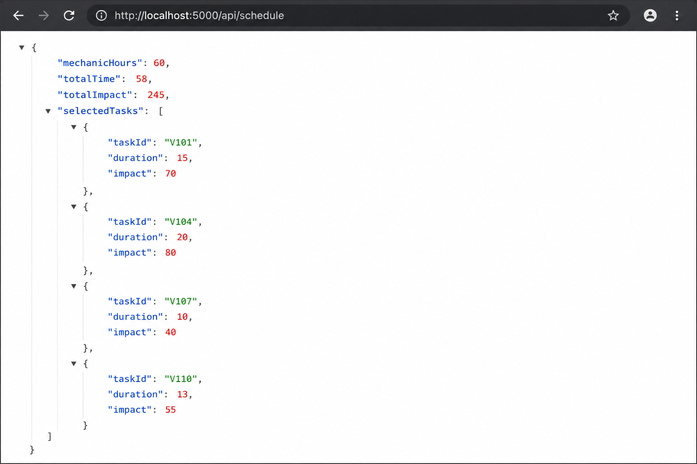

# Vehicle Maintenance Scheduler

## Overview

This project is a backend microservice that optimally schedules vehicle maintenance tasks based on available mechanic hours.

It ensures that the **total time does not exceed capacity** while **maximizing the overall impact** of selected tasks.

---

## Problem Statement

Each vehicle maintenance task contains:

* **Duration** → Time required to complete the task
* **Impact** → Importance score of the task

Given limited mechanic hours, the goal is to:

* Select the best combination of tasks
* Keep total duration within limits
* Maximize total impact

---

## Approach

This problem is solved using the **0/1 Knapsack Algorithm**:

* Duration → Weight
* Impact → Value

Dynamic Programming is used to compute the optimal subset of tasks.

---

## Tech Stack

* Node.js
* Express.js
* Axios

---

## API Endpoint

### GET `/api/schedule`

Returns the optimized schedule of tasks.

---

## Sample Output



---

## How to Run

```bash
npm install
npm start
```

Open in browser:

```
http://localhost:5000/api/schedule
```

---

## Project Structure

```
vehicle-maintenance-scheduler/
│
├── logging_middleware/
├── notification_app_be/
│   ├── controllers/
│   ├── routes/
│   ├── services/
│   ├── utils/
│   ├── app.js
│   └── server.js
│
├── notification_system_design.md
├── output.png
├── package.json
└── README.md
```

---

## System Design

```
Client → Express API → Fetch External APIs → Knapsack Logic → Response
```

---

## Features

* Real-time data fetching from APIs
* Optimized task scheduling
* Clean modular backend structure
* Error handling and validation
* Logging middleware support

---

